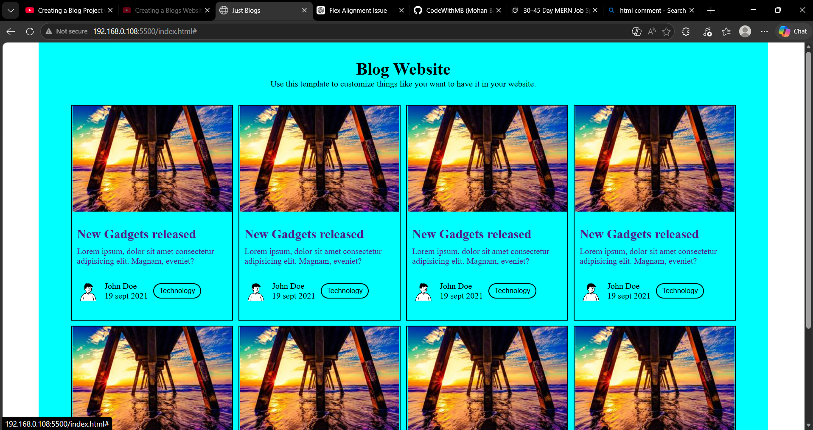

# My First Frontend Project - Blog Website

This is my very first frontend project built with pure HTML and CSS.

## What I Learned
- CSS Grid (auto-fit and minmax)
- Responsive design (4 cards in a row on desktop, stacks on mobile)
- Basic card layout and styling

## Features
- Responsive blog post grid
- Clean and colorful design
- Hover-ready cards (can be improved later)

## Screenshots

*(Replace the text above with actual image names after you add screenshots)*

## Tech Stack
- HTML5
- CSS3
- CSS Grid + Flexbox

## Live Demo
(If you host it on GitHub Pages, add the link here later)

---

Made with ❤️ during my 30-45 day MERN preparation